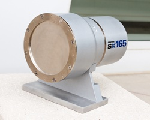

MarCCD
-------



Intoduction
```````````

The SX165 features a round, 165 mm diameter active area, and a versatile, high resolution CCD chip. It is the ideal X-ray detector for research applications with both synchrotrons and rotating anode X-ray sources.

Module configuration
````````````````````

The minimum configuration file is *config.inc* :

.. code-block:: sh

  COMPILE_CORE=1
  COMPILE_SIMULATOR=0
  COMPILE_SPS_IMAGE=1
  COMPILE_ESPIA=0
  COMPILE_FRELON=0
  COMPILE_MAXIPIX=0
  COMPILE_PILATUS=0
  COMPILE_BASLER=0
  COMPILE_MARCCD=1
  COMPILE_CBF_SAVING=0
  export COMPILE_CORE COMPILE_SPS_IMAGE COMPILE_SIMULATOR \
         COMPILE_ESPIA COMPILE_FRELON COMPILE_MAXIPIX COMPILE_PILATUS COMPILE_MARCCD\
         COMPILE_BASLER COMPILE_CBF_SAVING


See :ref:`Compilation`

Installation
`````````````

- First you have to start the server part on the Marccd host: marccd -r
- Then you can launch your lima/marccd client on another host, as the marccd server can be reached by network


Configuration
``````````````

There are 4 parameter to be filled by your Lima client:

	- The IPAddress of the host where the marccd server is running
	- The port of the marccd server process
	- The detector target path: the path where will be saved the marccd image files
	- Reader timeout: in ms, the timeout after which the plugin will be in fault if no marccd image file is present 

